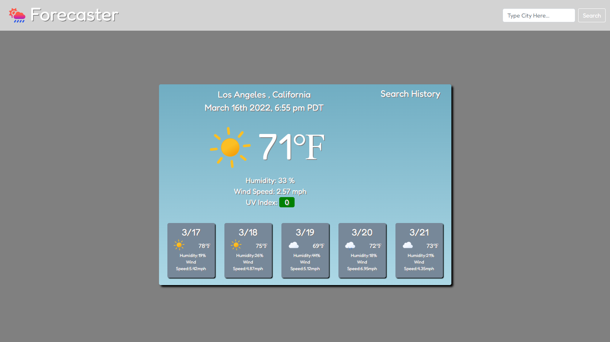

# Weather-Dashboard
Weather Dashboard is a weather application that allows users to get the weather forecast for the city that is searched, along with other useful information such as weather conditions, humidity, wind speed, and UV index. The local date and time for the searched city will show up above the temperature. The weather icon for the city will change based on the weather for that day. Users are able to save their search history on the right, and if they click on the button for that city, they are able to get the weather information for that city again. 

## Technologies Used
HTML, CSS, and javascript were used to build the webpage. Bootstrap, fontawesome, and google fonts were used for layout and design. One Call API and Geocoding API from openweathermap were used to pull data for the weather forecasts. Weather icons were generated from Github.io from Bas Milius, links will be attached below.

https://github.com/basmilius/weather-icons

https://basmilius.github.io/weather-icons/index-fill.html

## Future Implementations
An hourly option will be added to allow for more in depth details regarding the weather for the entire day. Air pollution rating will also be provided to the users to inform about air quality. Icons should also update along with the time of the day, instead of just using one icon for each scenario of weather.

## Links 

https://github.com/ycheng2021/Weather-Dashboard

https://ycheng2021.github.io/Weather-Dashboard/

